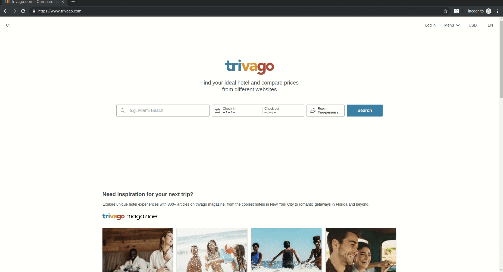

# TriMamba

TriMamba is a collection of tools aimed to gather event information from different sources into a database.

This project was part of the [Trivago Tech Camp 2019](https://techcamp.trivago.com/).

## Contents

- [TriMamba](#trimamba)
  - [Contents](#contents)
  - [What is TriMamba](#what-is-trimamba)
  - [Participants](#participants)
  - [Usage](#usage)
    - [Requirenments](#requirenments)
    - [eventbrite-mamba](#eventbrite-mamba)
    - [Chrome extension](#chrome-extension)

## What is TriMamba

TriMamba was a short project in the scope of the 2019th [TechCamp](https://techcamp.trivago.com/) by [Trivago](https://company.trivago.com/). It was a two weeks project where students tried to build a small product prototype that could be used in an global application.

## Participants

- [Dzheko Akperov](https://github.com/dzh17)
  - _bundesliga-mamba_ crawler written in Kotlin  
    Crawls event data from the official [Bundesliga website](https://www.bundesliga.com/de/bundesliga/spieltag)
  - Chrome extension for [trivago.com](https://trivago.com) written in JavaSript
- [Fabian Fritzsche](https://github.com/salzian)
  - _eventbrite-mamba_ written in NodeJS  
    Fetches data from the official [Eventbrite API](https://www.eventbrite.com/platform/api)
  - Backend setup (Docker, Elastic stack, Nginx)

## Usage

### Requirements

TriMamba uses the [Elastick Stack](https://www.elastic.co/products/) to store and visualize data. Both [elasticsearch](https://www.elastic.co/products/elasticsearch) and [Kibana](https://www.elastic.co/products/kibana) need to be setup in advance. For our purposes we dockerized both and ran them linked besides the crawlers.

Before pushing data to the database, make sure to [create an index](https://www.elastic.co/guide/en/elasticsearch/reference/current/mapping.html) first using the mapping in `common/mappings.json`. Note the chosen index name for later usage.

### eventbrite-mamba

- Install using `npm install`
  - Create a .env file in the node application's root directory and set the environment variables for
    - `ELASTIC_URI`: elasticsearch database url + index name (`https://example.com/events`)
    - `TOKEN_EVENTBRITE`: [Eventbrite API secret](https://www.eventbrite.com/platform)
  - local
    - run using `npm start`
  - docker
    - Build the `Dockerfile` with `docker build --tag eventbrite-mamba .`
    - Run the image with `docker run --env-file .env eventbrite-mamba`

### Chrome extension

The extension was running on a pivate development environment. In order to use it, setup elasticsearch as described above and add event data with one of the crawlers or manually. Also be sure to replace the server URL in `contentScript.js`.

The current extension is a very early prototype. To avoid [Chrome's cross-origin blocking](https://www.chromium.org/Home/chromium-security/extension-content-script-fetches) you need to start Chrome/Chromium with these command line arguments: `--disable-web-security --user-data-dir`

To add the chrome extension, go to `chrome://extensions/` and click *Load unpacked* in the top-left corner. Choose the `manifest.json` file of the extension and confirm. Now navigate to <https://trivago.com> and search for a city. For now, geocoding is not supported. The extension simply uses the city name from the webpages title. 

The results will be shown above the search results of trivago.

